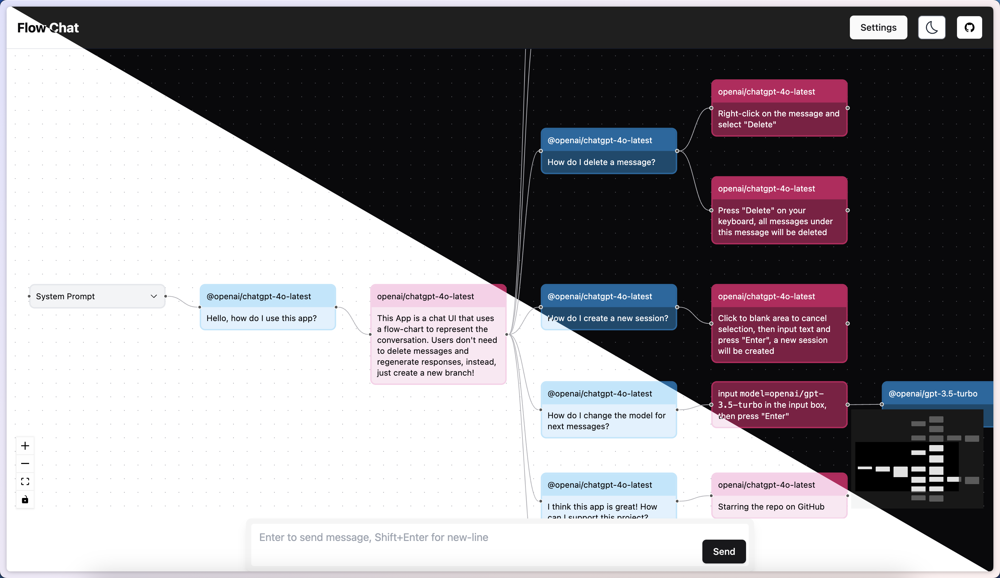

# Flow Chat

[](https://app.netlify.com/sites/flow-chat/deploys)

A simple chat app with flow chart. [Demo](https://flow-chat.lemonneko.moe/)



## Development

This project use `.tool-versions` to manage the version of the tools, if you use [`asdf`](https://asdf-vm.com/), you can use the following command to install the tools:

```bash
asdf install
```

Then you can use the following command to start the development server:

```bash
pnpm install
pnpm dev
```

## Build

```bash
pnpm build
```
