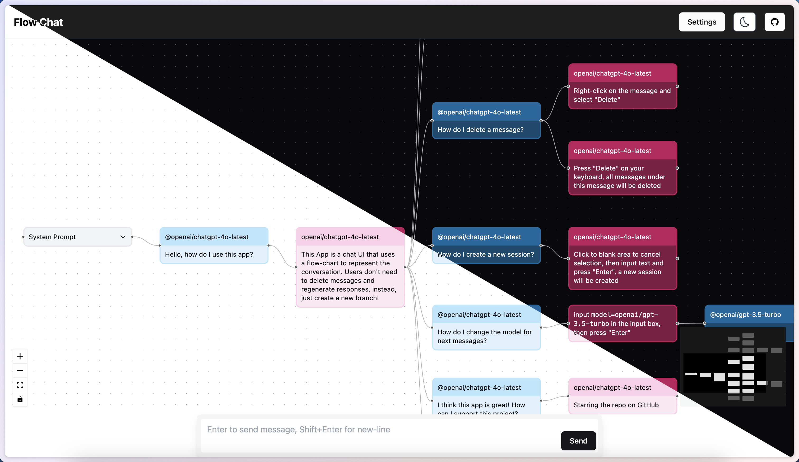

# Flow Chat

A simple chat app with flow chart.



## Features

- Text Generation: basic feature of a chat app
- Image Generation: generate image from text
- Fork: create a new branch from a message
- Switch model: switch between different models

## Development

This project use `.tool-versions` to manage the version of the tools, if you use [`asdf`](https://asdf-vm.com/), you can use the following command to install the tools:

```bash
asdf install
```

Then you can use the following command to start the development server:

```bash
pnpm install
pnpm dev
```

## Build

```bash
pnpm build
```

## Star History

[](https://www.star-history.com/#LemonNekoGH/flow-chat&Date)
